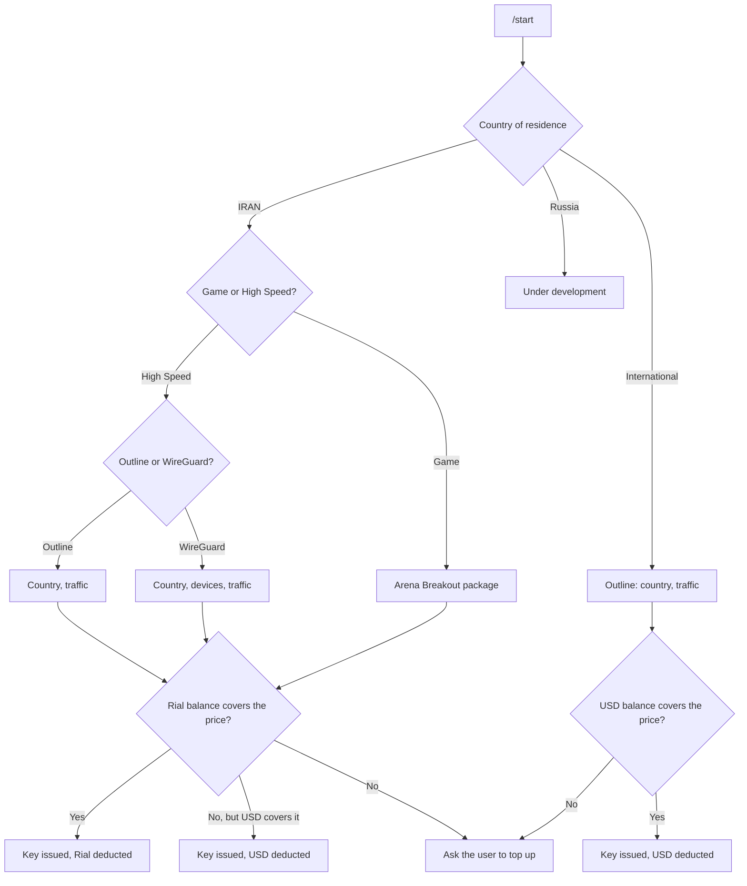

<div align="center">

# 🛡️ RoyalVPN Bot

**A Telegram storefront for Outline and WireGuard VPN keys —**
**with a Rial + USD wallet, crypto top-ups and a role-based admin toolkit.**


[Features](#-features) · [How it works](#-how-a-purchase-works) · [Quick start](#-quick-start) · [Admin guide](#-admin-guide) · [Project structure](#-project-structure)

</div>

---

## ✨ Features

| | |
|---|---|
| 🛒 **Self-service purchase** | Customers pick a location, a data package (and devices for WireGuard) and get their key instantly. |
| 🔑 **Two protocols** | **Outline** (Shadowsocks `ss://` keys) and **WireGuard** (`.conf` files, multi-device). Keys are valid for 30 days. |
| 💰 **Two wallets** | A **USD** balance and a **Rial** balance (`IRC` column) on every account. Iran menus charge Rial, International charges USD. |
| 🪙 **Crypto top-ups** | Automatic USD top-ups through NowPayments (Dogecoin). Rial top-ups are added by an admin. |
| ⭐ **VIP list** | Eligible users skip payment entirely. |
| 👑 **Admin toolkit** | Role-based commands (superadmin / admin / moderator) for balances, keys, servers and usage warnings — all listed by `/admin`, grouped by category. |
| 📈 **Usage tracking** | Outline usage is read from the servers; WireGuard traffic is synced into the database by a cron script. |
| 📣 **Notifications** | Usage warnings at 90 %, expiry notices, broadcasts and balance-added messages. |

---

## 🧭 How a purchase works



Tapping a package button buys it immediately — there is no separate confirmation step. Menus edit the same Telegram message as the customer navigates; the key (or `.conf` file) and the "amount deducted" notice arrive as new messages.

### Customer commands

| Command | Description |
|---|---|
| `/start` | Register and open the main menu |
| `/payment` | Choose a top-up method (crypto) |
| `/balance` | Show USD and Rial balances (also syncs pending crypto invoices) |
| `/userid` | Show your Telegram ID, username and balances |
| `/ks` | List your own keys with their usage |

---

## 💳 Wallets & pricing

| Menu | Wallet charged | Notes |
|---|---|---|
| **IRAN** — Outline, WireGuard, Game | **Rial** | If the Rial balance is too low but the USD balance covers the USD price, USD is charged instead (switchable, see below). |
| **International** — Outline | **USD** | USD only. |

Prices are defined **in USD** in [`pricing.js`](pricing.js). The Rial price is derived from them:

```
Rial price = USD price × IRC_PER_USD   (rounded to the nearest 1,000 Rial)
```

> **Example** — Outline 20 GB is $1.99, so at `IRC_PER_USD = 1000000` it costs **1,990,000 Rial**.

In `pricing.js` you can also:

- override any Rial price by hand (`IRC_OVERRIDES`) instead of deriving it,
- turn the USD fallback for Iran purchases off (`ALLOW_USD_FALLBACK_FOR_IRC = false`),
- change the rounding step (`IRC_ROUND_TO`).

> ⚠️ The bot **refuses to start until the exchange rate is set**, so it can never charge a wrong amount by accident. The rate does not update itself — when the Rial moves, edit the number and restart.

---

## 🚀 Quick start

**Requirements:** Node.js 18+ (LTS recommended), MySQL or MariaDB, a Telegram bot token from [@BotFather](https://t.me/BotFather), and at least one Outline and/or WireGuard server.

```bash
# 1. Get the code
git clone https://github.com/arkh91/RoyalVPN_bot.git
cd RoyalVPN_bot
npm install

# 2. Create the database (fresh install)
mysql -u <user> -p <database> < db.sql

# 3. Configure (see the table below)
vi token.js
vi db.js
vi servers.js
vi pricing.js          # set CONFIGURED_IRC_PER_USD

# 4. Run
node main.js
```

To keep it running in the background:

```bash
npm install -g pm2
pm2 start main.js --name royalvpn-bot
pm2 save
```

**Upgrading an existing database?** Run the migration once instead of `db.sql`:

```bash
mysql -u <user> -p <database> < migrations/2026-09-add-irc-wallet.sql
```

It adds the `IRC` (Rial) column next to `CurrentBalance`. Read the comments in that file first — the `ADD COLUMN` gives every existing user the default balance unless you also run the optional `UPDATE`.

---

## ⚙️ Configuration

| File | What to set |
|---|---|
| `token.js` | `TELEGRAM_BOT_TOKEN`, `NOWPAYMENTS_API_KEY`, `IPN` |
| `db.js` | MySQL host, user, password and database name |
| `servers.js` | Every Outline server: `apiUrl` (management API URL), `apiKey`, `aliases` |
| `callbacks.json` | Maps menu buttons to server names (`speed_ger` → `Ger28`, …). Separate maps for the regular and International menus. |
| `pricing.js` | **`CONFIGURED_IRC_PER_USD`** (required), price tables, rounding, fallback switch |

The exchange rate can also be passed as an environment variable, which takes priority over the file:

```bash
IRC_PER_USD=1000000 node main.js
```

WireGuard servers live in the database (`vpn_servers`); `vpn_server_manager.sh` is an interactive helper for viewing, inserting and updating server rows.

---

## 🗄️ Database

| Table | Purpose |
|---|---|
| `accounts` | One row per Telegram user: `CurrentBalance` (USD) and `IRC` (Rial) wallets |
| `payments` | Every top-up: crypto invoices and manual admin credits |
| `UserKeys` | Issued Outline keys (`FullKey`, `GuiKey`, server, dates) |
| `wg_clients` | WireGuard peers with usage counters and lifecycle flags (`is_active`, `is_expired`, `is_suspended`, `is_deleted`) |
| `vpn_servers` | Server inventory (name, IP, status) |
| `countries` | Country reference data |
| `admins` | Admin accounts and their role |
| `visit` | Log of `/start` visits |

**Rial amounts are whole numbers.** The `IRC` column is `DECIMAL(15,0)`, so balances of 10 digits and more are fine.

---

## 👑 Admin guide

### Roles

| Role | Can do |
|---|---|
| `superadmin` | Everything, including `/admincommand` (manage admins) and `/broadcast` |
| `admin` | Balances, keys, servers, usage tools |
| `moderator` | Read-only lookups such as `/keystatus` |

Run **`/admin`** (aliases **`/hc`** and **`/HiddenCommands`**) to see exactly what *your* role can use. The list is generated from the command registry, so it is always current.

### Choosing the wallet: `usd` or `rial`

Every command that touches a balance takes the wallet as an argument. **Sending the command with no arguments prints its usage**, and a call without a currency word is rejected — nothing is credited by accident.

```text
/usernameADDbalance usd  arkh916058 2
/usernameADDbalance rial arkh916058 180000
/useridADDbalance   rial 123456789  180000
/checkbalance       rial 10
```

The `usd` / `rial` word may appear anywhere among the arguments; the examples above show the canonical order.

### Command reference

#### 👑 Admin

| Command | Description |
|---|---|
| `/admin` · `/hc` · `/HiddenCommands` | Commands available to your role, grouped by category |
| `/admincommand add\|remove <@username\|UserID> [role]` | Add, change or deactivate an admin *(superadmin)* |
| `/broadcast <message>` | Send a message to every user *(superadmin)* |
| `/sendMessage <UserID> "<msg>"` | Send a message to one user as the bot |

#### 👤 Account

| Command | Description |
|---|---|
| `/userbalance <username>` | A user's USD and Rial balance |
| `/userbalanceuserID <UserID>` | Same, by Telegram ID |
| `/usernameADDbalance <usd\|rial> <username> <amount>` | Add funds by username |
| `/useridADDbalance <usd\|rial> <UserID> <amount>` | Add funds by ID |
| `/useridADDbalanceNotify <usd\|rial> <UserID> <amount>` | Add funds and DM the user their new balance |
| `/useridUpdatebalance <usd\|rial> <UserID> <newBalance>` | **Set** a balance to an exact value (no payment record) |
| `/checkbalance <usd\|rial> <count>` | Top N users by balance |
| `/listusers [count]` · `/lu` | Most recently registered users |

#### 🔑 Keys (Outline + WG)

| Command | Description |
|---|---|
| `/keystatus <key>` | Look up any key's owner, status and usage |
| `/keyusername <username>` | A user's Outline **and** WireGuard keys (last 60 days or still active) |
| `/keyuserid <UserID\|username>` | A user's Outline **and** WireGuard keys from the last 31 days |

#### 🅾️ [Outline]

| Command | Description |
|---|---|
| `/expiredkeys` | Keys issued exactly 30 days ago |
| `/expiredkeysnotify` | Keys that expired today but are still on the server — and DM their owners |
| `/removekey <key>` | Remove a key from the server **and** the database |
| `/removekeyexpired <key>` | Remove from the server only; the database row stays |
| `/updatekey "<oldkey>" "<newkey>"` | Replace a key in the database. **Both keys must be in double quotes** — key names can contain spaces (e.g. a flag emoji). |

#### 🔌 [WG]

| Command | Description |
|---|---|
| `/wgremovekey <name\|key>` | Remove the peer from its server and delete it from the database |
| `/wgremovekeyexpired <name\|key>` | Remove the peer from its server and mark it expired (history is kept) |

#### 🖥️ Servers & Usage

| Command | Description |
|---|---|
| `/servercheck` · `/sc` | Per-server usage/limit report for recent keys, and which ones have expired |
| `/UsageWarning` | Warn the owner of every key that used 90 % or more of its data |
| `/usagewarninginfo [min] [max]` | Same scan, view-only: lists keys in a usage range without messaging anyone |

> Commands registered without a known category show up under **📦 Other**.

---

## ⏱️ Background jobs

**WireGuard traffic sync** — [`sync-wg-traffic.sh`](sync-wg-traffic.sh) runs on the management server every 5 minutes. For each active WireGuard server it reads peer stats over SSH, adds the traffic deltas to `wg_clients`, expires peers that pass their data limit, blocks suspended peers and re-enables peers whose flag an admin cleared.

```cron
*/5 * * * * /path/to/RoyalVPN_bot/sync-wg-traffic.sh
```

```bash
./sync-wg-traffic.sh --debug     # verbose dry run: no DB writes, no wg/iptables changes
DB_JS=/path/to/db.js ./sync-wg-traffic.sh
```

To bring an expired WireGuard peer back after a top-up, raise its limit and clear the flag — the next run re-enables it:

```sql
UPDATE wg_clients SET is_expired = 0, max_data_limit = <new_bytes> WHERE client_id = <id>;
```

`WG_checker.sh` loops over the active servers in `vpn_servers` and checks each one over SSH.

---

## 🗂️ Project structure

```text
RoyalVPN_bot/
├── main.js                      Entry point: menus, purchase flows, payment callbacks
├── commands.js                  Slash commands (customer + most admin commands)
├── commandRegistry.js           Command list + categories that /admin reads
├── admin_help_handler.js        /admin, /hc, /HiddenCommands
│
├── currency.js                  USD / Rial wallets: parsing, formatting, validation
├── pricing.js                   Price tables and the Rial exchange rate
│
├── *_handler.js                 One file per admin command group
│   ├── command_Admin.js         /admincommand
│   ├── broadcast_handler.js     /broadcast
│   ├── checkbalance_handler.js  /checkbalance
│   ├── useridaddbalancenotify_handler.js
│   ├── useridupdatebalance_handler.js
│   ├── keystatus_handler.js     /keystatus
│   ├── ks_handler.js            /ks
│   ├── listusers_handler.js     /listusers, /lu
│   ├── removekeyexpired_handler.js
│   ├── wgremovekeys_handler.js  /wgremovekey, /wgremovekeyexpired
│   ├── servercheck_handler.js   /servercheck, /sc
│   ├── usagewarning_handler.js
│   └── usagewarninginfo_handler.js
│
├── db/
│   ├── KeyCreation.js           Outline key issuing
│   ├── KeyCreationInternational.js
│   ├── WGKeyCreation.js         WireGuard peer + .conf issuing
│   ├── getUserBalance.js        Read a wallet
│   ├── deductBalance.js         Charge a wallet
│   ├── choosePaymentCurrency.js Decide which wallet pays (Rial first, USD fallback)
│   ├── creditAccount.js         Add funds + write the payments row (one transaction)
│   ├── insertUser.js · insertVisit.js · keyExists.js · flags.js
│
├── migrations/                  One-off SQL for existing databases
├── payments.js · createNowPaymentsSession.js    Crypto (NowPayments) invoices
├── checkEligibility.js · Game_Arena_checkEligibility.js    VIP list checks
├── getKeysUsage.js · KeyStatus.js · UpdateKey.js · checkBalance.js
│
├── servers.js · callbacks.json · token.js · db.js    Configuration
├── db.sql                       Database schema
└── sync-wg-traffic.sh · WG_checker.sh · vpn_server_manager.sh    Operations scripts
```

`ManualPaymentAdd.js` is a one-off command-line script for crediting a payment by hand, and `Test_Main.js` is an old scratch copy of `main.js` that the bot never loads.

---

## 🧩 Adding a command

Register the command once, at the top of its file (outside the function that receives `bot`), and it appears in `/admin` automatically:

```js
const registry = require('./commandRegistry');

// registry.register(usage, description, roles, category)
// Categories: 'Admin' | 'Account' | 'Keys' | '[Outline]' | '[WG]' | 'Servers' | 'Other'
registry.register(
    '/mycommand <UserID>',
    'what it does, in one line',
    ['superadmin', 'admin'],
    'Account'
);
```

Things to know:

- Registering the same command twice **replaces** the earlier entry, so it is never listed twice.
- A command registered without a category is looked up in `DEFAULT_CATEGORY_BY_COMMAND` inside `commandRegistry.js`, then falls back to **📦 Other**.
- For any command that needs a wallet, reuse `extractCurrency()` / `formatMoney()` from `currency.js` and `creditAccount()` from `db/creditAccount.js` so balances and `payments` rows stay consistent.
- Print the usage when the command is called with no or wrong arguments — it is the convention used by every balance command.

---

## 🔒 Security notes

- **Never commit real credentials.** `token.js`, `db.js` and `servers.js` ship as templates; keep the real values out of git. A minimal `.gitignore` for a production checkout:

  ```gitignore
  node_modules/
  token.js
  db.js
  servers.js
  ```

  (Use `git update-index --skip-worktree token.js db.js servers.js` if you want to keep the template files tracked but ignore your local edits.)
- **Revoke anything that was ever committed.** If a bot token, API key or password has appeared in a commit — even in a comment or a test file — treat it as leaked: revoke it (bot tokens via `@BotFather` → `/revoke`) and issue a new one. Removing the line later does not remove it from git history.
- Admin commands check the caller against the `admins` table on **every** call; new commands should do the same.
- Balance changes go through `db/creditAccount.js`, which writes the `payments` row and the balance in one transaction.

---

## 🛠️ Troubleshooting

| Symptom | Cause and fix |
|---|---|
| Bot crashes on start with `pricing.js: set IRC_PER_USD …` | The exchange rate is not set. `vi pricing.js` and set `CONFIGURED_IRC_PER_USD`, or start with `IRC_PER_USD=… node main.js`. |
| A command works but is missing from `/admin` | Its file has no `registry.register(...)` call. Add one (see [Adding a command](#-adding-a-command)). |
| A command appears under **📦 Other** | It has no category. Pass one as the 4th argument, or add it to `DEFAULT_CATEGORY_BY_COMMAND` in `commandRegistry.js`. |
| `/updatekey` says the key is not found | Wrap **both** keys in double quotes; keys with spaces are otherwise split in the wrong place. The lookup only checks the database. |
| A balance command just prints its usage | The currency word (`usd` / `rial`) is missing or an argument is malformed. Compare with the usage text it printed. |
| `ER_DUP_FIELDNAME` when running the migration | The `IRC` column already exists — skip the `ADD COLUMN`. |
| Telegram error `ETELEGRAM … can't parse entities` | A message with `parse_mode: 'HTML'` contains a raw `<` or `&`. Escape user-supplied text (the `escapeHtml` helpers in the handlers). |

---

<div align="center">

Built with [`node-telegram-bot-api`](https://github.com/yagop/node-telegram-bot-api), [`mysql2`](https://github.com/sidorares/node-mysql2) and [`axios`](https://github.com/axios/axios).

</div>
